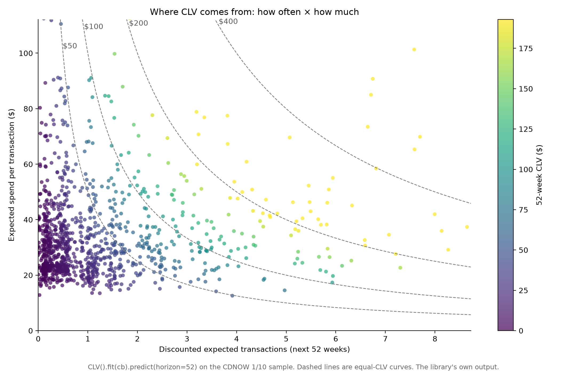
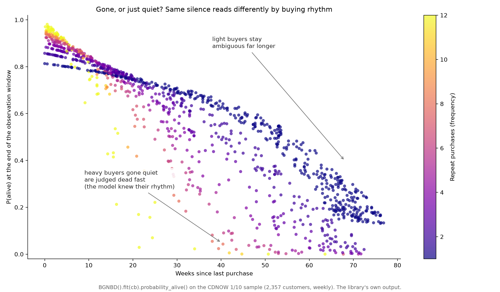
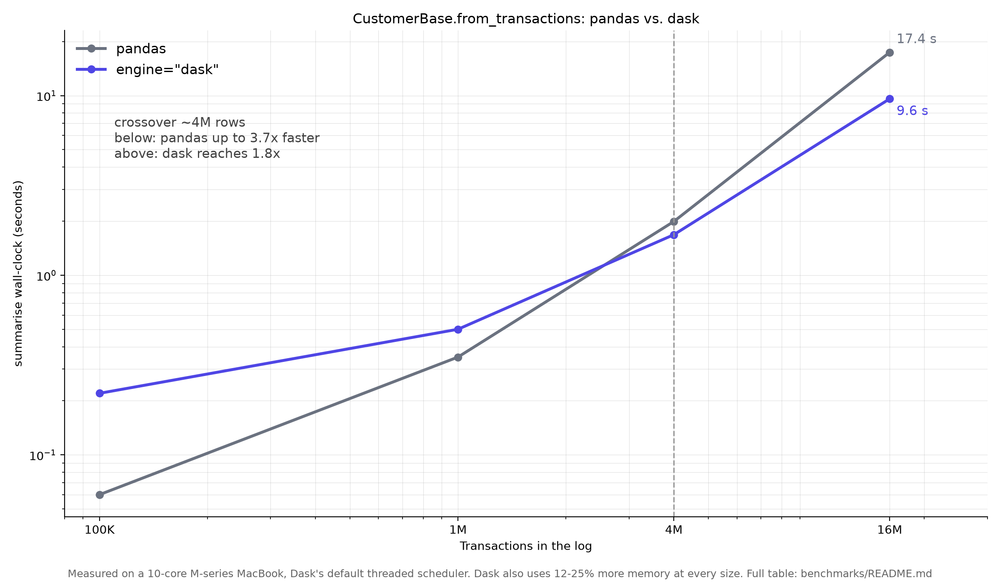
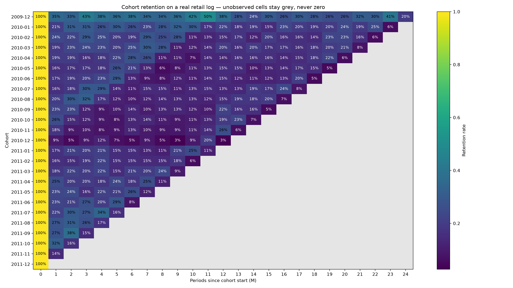

<p align="center">
  <picture>
    <source media="(prefers-color-scheme: dark)" srcset="docs/brand/clvkit-symbol-dark.svg">
    
  </picture>
  &nbsp;&nbsp;
  <picture>
    <source media="(prefers-color-scheme: dark)" srcset="docs/brand/clvkit-dark.svg">
    
  </picture>
</p>

<p align="center">
  <em>Four parameters. Six decimal places. No trace to read.</em>
</p>

<p align="center">
  
  
  
  <a href="https://github.com/astral-sh/ruff"></a>
  
  
  
</p>

<p align="center">
  <strong>r = 0.242595 against a published 0.243 &middot; 4 dependencies &middot; one <code>scipy.optimize</code> run &middot; a DataFrame back</strong><br>
  <sub>BG/NBD fit on the CDNOW 1/10 systematic sample, 2,357 customers, 39-week calibration, which is the same data Fader, Hardie &amp; Lee published <code>r = .243, α = 4.414, a = .793, b = 2.426</code> on in 2005. The right-hand numbers are not transcribed: <a href="tests/test_bgnbd_golden.py">the test suite fits them</a> on every push, and the build fails if any drifts past half a unit in the paper's last printed digit. <a href="#reproduced-estimates">The full table</a> &middot; <a href="#the-whole-thing">six lines to run it</a>.</sub>
</p>

---

You have a transaction log (`customer_id, date, amount`) from a business where
customers buy whenever they feel like it. Nobody cancels a subscription, so
churn is **latent**: you never observe a customer leaving, you only ever observe
them not coming back yet. Three questions follow, and your warehouse cannot
answer any of them, because they need statistical inference rather than a
`GROUP BY`:

1. Is this customer still alive, and how much will they buy next period?
2. When they do buy, how much will they spend?
3. What is each customer worth over a horizon, and how does a cohort decay?

The BTYD / probability-model tradition (Fader, Hardie, et al.) answered these
decades ago. The Python tooling for it is what went missing.

## Why this exists

Two libraries occupy this space, and each is out of reach in its own way.

**[`lifetimes`](https://github.com/CamDavidsonPilon/lifetimes) is archived.**
It was the de-facto frequentist BTYD library, and its conventions are in every
blog post and notebook on the subject. The owner archived it on 2024-06-28; the
last release was 0.11.3, in July 2020, and it still draws 248,263 downloads a
month. Its successor
[`btyd`](https://github.com/ColtAllen/btyd) is archived too, and stopped at
0.1b3 in November 2022 without ever leaving beta. That one declares
`requires_python = ">=3.8,<3.10"`, so it will not install on Python 3.10 or
anything after it. `clvkit` keeps the conventions and runs. If you know
`lifetimes`, [you already know this library](#migrating-from-lifetimes).

Both of those READMEs now point readers at the same replacement.

**[`pymc-marketing`](https://github.com/pymc-labs/pymc-marketing) is
Bayesian.** It is excellent, actively maintained, and has a wider model roster
than `lifetimes` ever did, covariates included. It ships sensible default
priors and a MAP path one keyword away, so it does not demand that you bring
your own priors or read a trace. What it does bring is the shape of a Bayesian
workflow: a PyMC / PyTensor / ArviZ stack behind a C compiler, Python 3.12 or
later, MCMC as the default fit, and an `InferenceData` object standing between
you and your four numbers.

`clvkit` fits by maximum likelihood, in one `scipy.optimize` run (Nelder-Mead,
then an L-BFGS-B polish), on four dependencies, and hands back a DataFrame.
That is the whole difference. It is a narrower tool, and for an analyst who
wants parameters and a CSV it is the cheaper one.

And it isn't a weekend project I'll lose interest in. It's the CLV engine for
customer-analytics work I'm building on top of it, so it stays installable and
stays correct — CI checks both on every push.

## Install

Not on PyPI yet. Until it is:

```console
uv add git+https://github.com/nasserboan/proj-clv
```

Python 3.13+. Four runtime dependencies (numpy, scipy, pandas, matplotlib), and
one optional extra, `dask`, for logs too big to summarise in pandas. See
[Large transaction logs](#large-transaction-logs).

<table>
  <tr>
    <td width="50%"></td>
    <td width="50%"></td>
  </tr>
  <tr>
    <td align="center"><sub><code>CLV().fit(cb).predict(horizon=52)</code> — where lifetime value comes from: how often × how much, along equal-CLV curves.</sub></td>
    <td align="center"><sub><code>BGNBD().fit(cb).probability_alive()</code> — gone, or just quiet? The same silence reads differently by buying rhythm.</sub></td>
  </tr>
</table>

<sub>Both are the library's own output on the CDNOW 1/10 sample.</sub>

## The whole thing

```python
import pandas as pd

from clvkit import CLV, CustomerBase

log = pd.read_csv("transactions.csv", parse_dates=["date"])  # customer_id, date, amount

cb = CustomerBase.from_transactions(log, time_unit="W", collapse="D")
result = CLV().fit(cb).predict(horizon=52, discount_rate=0.001)

# expected_purchases, discounted_expected_transactions, expected_spend, clv
result.to_pandas()  # indexed by customer_id
result.plot()
```

`CustomerBase` is the one input currency: it turns the raw log into the RFM
sufficient statistic every model here consumes, and carries its own provenance
(`time_unit`, `collapse`, `observation_period_end`, `has_monetary`,
`on_negative`), so scoring a model fit in weeks against a base measured in
days is refused rather than quietly answered, and so is scoring it against a
base that kept a different set of purchases. The verbs are short and shared:
`fit` and `predict` everywhere, plus `probability_alive` on the transaction
models, where latent
attrition is the thing being estimated. Every result object plots itself and
hands you a DataFrame with `.to_pandas()`.

## Reproduced estimates

The reason to trust a likelihood is that it lands where the paper said it
would. `clvkit` fits BG/NBD and Gamma-Gamma on the canonical **CDNOW 1/10
systematic sample** (2,357 customers, the first 39 weeks as the calibration
period) and reproduces the published Fader–Hardie estimates. These are not
transcribed targets; the right-hand column is what
[`tests/test_bgnbd_golden.py`](tests/test_bgnbd_golden.py) and
[`tests/test_gamma_gamma.py`](tests/test_gamma_gamma.py) actually fit when you
run `uv run pytest`. CI runs that suite on every pull request and every push to
`main`, and again before a release builds, so a parameter drifting outside the
tolerance in the last column fails the build that would have shipped it, and
the pull request that caused it.

**BG/NBD**, from Fader, Hardie & Lee (2005), *"Counting Your Customers" the Easy
Way*, §7 / Figure 1:

| Parameter | Published | `clvkit` | Asserted to |
|---|---|---|---|
| `r` | 0.243 | 0.242595 | ±5e-4 |
| `α` (weekly) | 4.414 | 4.413602 | ±5e-4 |
| `a` | 0.793 | 0.792922 | ±5e-4 |
| `b` | 2.426 | 2.425907 | ±5e-4 |
| max log-likelihood | −9582.4 | −9582.4292 | ±0.1 |

**Gamma-Gamma**, from Fader & Hardie, [*The Gamma-Gamma Model of Monetary
Value*](https://brucehardie.com/notes/025/), §3:

| Parameter | Published | `clvkit` | Asserted to |
|---|---|---|---|
| `p` | 6.25 | 6.249690 | exact at 2 dp |
| `q` | 3.74 | 3.744180 | exact at 2 dp |
| `γ` | 15.44 | 15.442988 | exact at 2 dp |

The BG/NBD tolerance is the strongest claim the published numbers support: the
paper prints three decimals, so ±5e-4 is half a unit in its last digit. There
is no tighter target to hit. Gamma-Gamma is asserted by rounding to the two
decimals the note prints, which the fit matches exactly. The RFM summary
feeding Gamma-Gamma is itself pinned to the note's Table 1 (946 repeat buyers,
mean z̄ = \$35.08).

Parameters can print correctly while the prediction formula is wired wrong, so
the golden tests also replay the papers' own validations: the BG/NBD
conditional expectation (eq. 10) is checked against 39 weeks of holdout
purchasing the model never saw, bucket by bucket, and both likelihoods have
pinpoint tests asserting an exact log-likelihood value at a known parameter
point, so a mis-transcribed hypergeometric term fails a specific test rather
than surfacing as a vague drift.

### Two questions about time, two arguments

The paper measures time **continuously in weeks** (`T_i = 39 − time of first
purchase`) while collapsing purchases at the **daily** resolution its CDNOW
records carry. Those are separate questions, so `clvkit` gives them separate
arguments:

```python
CustomerBase.from_transactions(log, time_unit="W", collapse="D")
#                                   ^ the ruler    ^ the event grain
```

`collapse` decides which transactions merge into one purchase. The counting
process the likelihoods assume has no notion of two events at the same instant.
`time_unit` decides what `recency` and `T` are reported in. The reproduced
estimates above come from exactly the line written here, with no rescaling
step: `α = 4.4136` is read straight off the fit.

`collapse` defaults to `time_unit`, which is why it is worth knowing about.
Asking for `time_unit="W"` alone does not merely change the units. It merges a
Monday and a Wednesday purchase into one event, and it takes the most from your
most frequent buyers, which drags the fit toward a less active base than you
have. On this same CDNOW sample it moves the estimates to
`r = 0.291, α = 6.852, a = 0.665, b = 2.320`. `from_transactions` warns when
a coarse grain is inherited rather than asked for, and tells you how many
transactions it absorbed:

```
UserWarning: time_unit='W' collapsed 74 of 700 transactions into earlier
purchases in the same period. [...] Pass collapse='D' to keep them and still
report time in 'W', or pass collapse='W' to say you meant this.
```

Naming `collapse` is read as consent, and the warning goes away.

### Large transaction logs

Summarising is the only step here whose cost scales with *transactions* rather
than with customers. Once the log is an RFM table, the likelihood works on four
numpy arrays of length `n_customers`, and `scipy.optimize` is sequential
anyway. So a big log is a summarising problem, and nothing else.

`engine="dask"` moves that one step off pandas:

```console
uv add 'clvkit[dask]'
```

```python
import dask.dataframe as dd

log = dd.read_parquet("transactions/")
cb = CustomerBase.from_transactions(log, time_unit="W", collapse="D", engine="dask")
matrix = CohortMatrix.from_transactions(log, period="M", engine="dask")
```

What comes back is an ordinary pandas-backed `CustomerBase`, per-customer and
small, so every model, plot and `.to_pandas()` downstream is unchanged. It
doesn't keep the per-bucket event frame, since that frame is the memory the
engine exists to avoid, so `.split()` refuses on it and says so. `cb.engine`
records which engine built it.

Two honest caveats, both measured. The benchmark and its numbers are in
[`benchmarks/`](benchmarks/README.md):

- **The crossover is around 4 million transactions.** Below it pandas is up to
  3.7× faster, because Dask's graph and shuffle cost more than they distribute.
  Above it Dask reaches 1.8–2.2× by 16 million rows.
- **It doesn't lower the memory ceiling on one machine.** With Dask's default
  in-process threaded scheduler, peak RSS came out 12–25% *higher* than pandas
  at every size measured. Raising the ceiling takes a distributed scheduler,
  with workers in their own processes, in front of the same call.

<p align="center">
  
  <br>
  <sub>Summarising wall-clock vs. log size. The one flag (<code>engine="dask"</code>) only pays off past the ~4M-row crossover; below it pandas wins. Numbers from <a href="benchmarks/README.md">the benchmark</a>.</sub>
</p>

## Canon vs. opinion

Two different kinds of decision live inside a CLV library, and conflating them
is how you end up unable to audit your own numbers.

**Canon** is what the literature settled. `clvkit` implements it verbatim and
documents it in the API, not as a choice. The one that catches everybody:

> **`frequency` is the BTYD *repeat* count: total purchases minus one.**
> A customer with five purchases has `frequency = 4`. A customer with one
> purchase has `frequency = 0`, `recency = 0`, and `monetary_value = 0`. This
> is the #1 gotcha in the tradition, and every published estimate above depends
> on it being right.

**Opinion** is everything the literature leaves open but a library still has to
default. Each one is written up in **[`opinions.md`](opinions.md)** in the same
four beats: *the question · the options the literature actually offers · our
choice · why*:

| Question | Our default |
|---|---|
| Refunds and negative amounts | `on_negative="net"` — net each bucket, keep it only if it stays positive |
| Two purchases in one `collapse` period | Collapse to one event, sum the amounts |
| What `monetary_value` averages | Repeat transactions only, excluding the first |
| When monetary independence is "violated" | Warn, never error: \|Spearman ρ\| ≥ 0.30 or η² ≥ 0.25 |
| What `margin` defaults to | `1.0` — so `CLV.predict` returns **revenue**, not contribution |
| Unobserved cohort cells | `NaN`, never `0` — "we don't know yet" ≠ "nobody bought" |
| What a model-based survival curve is | Cohort **mean** P(alive), one row per acquisition cohort, plotted at the age it reached |

Four of those seven are arguments you can pass: `on_negative` on
`CustomerBase.from_transactions`, `margin` on `CLV.predict`, the two
thresholds (`max_correlation`, `max_eta_squared`) on `IndependenceCheck.holds`
(with `CLV(check_independence=False)` to switch that check off altogether)
and `period` on `CohortSurvival.predict`, which coarsens the cohort grain.

The other three are fixed. The collapse-to-one-event rule and `monetary_value`
excluding the first transaction are the shape of the statistic the likelihoods
assume. Change them and the fitted parameters stop meaning what the papers say
they mean. The cohort `NaN` policy is fixed because "we don't know yet" is not
a number.

So: override what's an argument, and where it isn't, the reasoning is written
down in one place where you can go and disagree with it.

## Migrating from `lifetimes`

Same conventions, fewer verbs. The RFM summary means what it always meant, the
calibration/holdout split works the way you expect, and the models are the same
models. Mostly you are deleting arguments.

| `lifetimes` | `clvkit` |
|---|---|
| `summary_data_from_transaction_data(df, "id", "date", monetary_value_col="amount")` | `CustomerBase.from_transactions(df)` |
| `calibration_and_holdout_data(df, ..., calibration_period_end=...)` | `cb.split(calibration_period_end=...)` |
| `BetaGeoFitter().fit(frequency, recency, T)` | `BGNBD().fit(cb)` |
| `ModifiedBetaGeoFitter()` | `MBGNBD()` |
| `bgf.conditional_expected_number_of_purchases_up_to_time(t, f, r, T)` | `model.predict(t)` |
| `bgf.conditional_probability_alive(f, r, T)` | `model.probability_alive()` |
| `GammaGammaFitter().fit(frequency, monetary_value)` | `GammaGamma().fit(cb)` |
| `ggf.conditional_expected_average_profit(f, m)` | `GammaGamma().fit(cb).predict()` |
| `ggf.customer_lifetime_value(bgf, f, r, T, m, time=12, discount_rate=0.01)` | `CLV().fit(cb).predict(horizon=12, discount_rate=0.01)` |
| a hand-rolled pandas cohort pivot | `CohortMatrix.from_transactions(df, period="M")` |

Three differences worth knowing before you port anything:

- **You pass a `CustomerBase`, not three parallel arrays.** `lifetimes` threads
  `frequency, recency, T` through every call, which makes it easy to hand a
  model the wrong vectors or the wrong time unit. `CustomerBase` carries the
  frame *and* its provenance, so the model can check.
- **Short verbs, no aliases.** `fit` and `predict` on every model, plus
  `probability_alive` on `BGNBD` and `MBGNBD`. The long
  `conditional_expected_number_of_purchases_up_to_time` family is gone.
- **`margin` is explicit and defaults to 1.0.** `customer_lifetime_value`
  returned whatever your `monetary_value` column happened to mean; `CLV.predict`
  returns revenue-based lifetime value unless you pass your own `margin`. See
  [`opinions.md`](opinions.md).

There is no `penalizer_coef`. The published estimates above are reproduced
without regularisation.

## What's in the box

```python
from clvkit import (
    BGNBD,
    CLV,
    MBGNBD,
    CohortMatrix,
    CohortSurvival,
    CustomerBase,
    GammaGamma,
)
```

**The input currency.** `CustomerBase.from_transactions(...)` → RFM summary
plus provenance; `.split(calibration_period_end=...)` → a calibration base and
a holdout frame, excluding customers born in the holdout window.
`engine="dask"` summarises a log too big for pandas, with the optional `dask`
extra.

**The CLV engine.** `BGNBD` (flagship) and `MBGNBD` (the never-returner
variant, where a customer can drop out after their *first* purchase) for
transaction flow; `GammaGamma` for spend per transaction, with no horizon, because
spend is time-independent; `CLV` composing the two into discounted lifetime
value, and assessing the independence assumption that composition rests on.

**Cohort retention.** `CohortMatrix.from_transactions(df, period="M",
metric="retention" | "revenue")` → the cohort triangle and its heatmap. It
reads the raw log directly, because per-period activity is exactly what the RFM
summary throws away. `CohortSurvival(transaction_model=...).fit(cb).predict()`
→ survival by acquisition cohort, as the mean fitted P(alive): survival for a
business that never observes anyone leaving, with no contractual assumption
borrowed.

<p align="center">
  
  <br>
  <sub><code>CohortMatrix.from_transactions(log, period="M").plot()</code> on the Online Retail II log. The grey cells are periods a young cohort hasn't lived through yet; a hand-rolled pivot paints them as churn.</sub>
</p>

Every prediction returns a result object with `.to_pandas()`, `.to_json()` and
`.plot()`. A chart by default, and never a trap.

## What clvkit will not do

The model roster is `BGNBD`, `MBGNBD` and `GammaGamma`, and it is meant to stay
that size. No covariates, no Bayesian fit, no further model families. Those live
in [`pymc-marketing`](https://github.com/pymc-labs/pymc-marketing), which does
them well; the boundary is the one drawn in [Why this exists](#why-this-exists).

A declared scope is what makes a finished library read as finished rather than
abandoned. This one is finished, not stalled — stopping here is the design.

## Example notebooks

Start with [`examples/start_here.ipynb`](examples/start_here.ipynb). It's a router,
not a lesson: four questions a business actually asks, each answered on real data
in a couple of cells, each ending with the sentence you could say in a meeting.
The first one runs your own `average ticket x frequency x margin` formula against
39 weeks of held-out CDNOW history and shows it overshooting by 61%.

The other two are the long versions. All three are executed top-to-bottom by CI
with [`nbmake`](https://github.com/treebeardtech/nbmake), so a change that breaks
an example turns the build red instead of leaving dead code in the docs.

| Notebook | What it covers | Data |
|---|---|---|
| [`examples/start_here.ipynb`](examples/start_here.ipynb) | What is a customer worth · is this one gone or just quiet · who gets the retention budget · why two retention charts disagree | Ships with the repo |
| [`examples/cdnow_clv.ipynb`](examples/cdnow_clv.ipynb) | `frequency`/`recency`/`T` drawn on four real customers → `CustomerBase` → the reproduced Fader–Hardie estimates → what passing RFM recency costs → holdout validation → `CLV().fit().predict()` | Ships with the repo |
| [`examples/online_retail_ii_cohort.ipynb`](examples/online_retail_ii_cohort.ipynb) | A cohort matrix built by hand on six customers → a real retail log → the transaction-log contract → `CohortMatrix` retention and revenue heatmaps | Fetched from UCI on first run (~43 MB, cached) |

If `recency` means "days since the last purchase" to you, start with section 0 of
the CDNOW notebook. This literature means something else by the word, and the two
definitions sit at opposite ends of the same timeline.

```bash
uv run pytest --nbmake --nbmake-timeout=900 examples/
```

To read them interactively, open either file in your own editor against the
project environment (`uv sync` installs the `ipykernel` they expect). The repo
does not vendor a notebook server.

## Credit

`clvkit` implements other people's work. The models are Peter S. Fader and
Bruce G. S. Hardie's, with Ka Lok Lee on two of the three, and the independent
comparison that makes the numbers checkable is Emine Persentili Batislam,
Meltem Denizel and Alpay Filiztekin's.

| What it powers | Paper |
|---|---|
| `BGNBD` | Fader, Hardie & Lee (2005), "Counting Your Customers" the Easy Way. *Marketing Science* 24(2), 275–284. [doi](https://doi.org/10.1287/mksc.1040.0098) |
| `GammaGamma` | Fader & Hardie (2013), The Gamma-Gamma Model of Monetary Value. [Note 025](https://www.brucehardie.com/notes/025/gamma_gamma.pdf) |
| `CLV` | Fader, Hardie & Lee (2005), RFM and CLV: Using Iso-Value Curves. *Journal of Marketing Research* 42(4), 415–430. [doi](https://doi.org/10.1509/jmkr.2005.42.4.415) |
| the benchmark's independent check | Batislam, Denizel & Filiztekin (2007), Empirical validation and comparison of models for customer base analysis. *IJRM* 24(3), 201–209. [doi](https://doi.org/10.1016/j.ijresmar.2006.12.005) |

**No PDFs ship with this package.** None of those papers carries a
redistribution licence, checked against CrossRef rather than assumed, so the
links above are the way to get them. Full citations and BibTeX are in
[`docs/references.md`](docs/references.md).

If you use `clvkit` in work you publish, cite the papers. The library is an
implementation; the result is theirs.

## Reading further

- **[`opinions.md`](opinions.md)**: every default the literature doesn't settle.
- **[`docs/references.md`](docs/references.md)**: the papers, with DOIs, BibTeX
  and the licence status of each.
- The primary sources themselves: [brucehardie.com](https://brucehardie.com/) is
  where all of this comes from.
