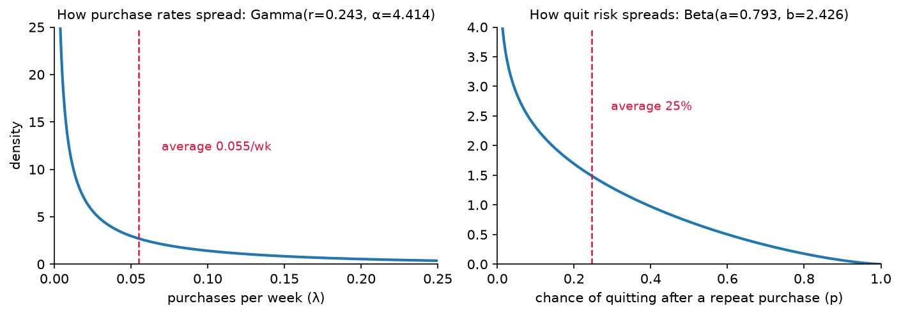

:html_theme.sidebar_secondary.remove:

clvkit
======

.. rst-class:: clv-tagline

   Four parameters. Six decimal places. No trace to read.

Buy-till-you-die models for a business where nobody cancels a subscription, so
you never observe a customer leaving — you only ever observe them not coming back
*yet*. Six lines take a transaction log to a per-customer CLV table, in 2.0 s
of wall clock on the CDNOW sample. Python 3.11+, four dependencies, no compiler.

.. code-block:: bash

   uv add clvkit     # or pip install clvkit

.. image:: _static/clv-scatter.png
   :alt: CLV against discounted transactions and expected spend
   :align: center
   :width: 80%

.. grid:: 1 2 2 2
   :gutter: 3
   :margin: 4 0 0 0

   .. grid-item-card:: :octicon:`download` Install
      :link: install/index
      :link-type: doc

      One line, four dependencies, no compiler. Get it into your environment.

   .. grid-item-card:: :octicon:`book` User Guide
      :link: user_guide/index
      :link-type: doc

      The key ideas, the four models, and the calls clvkit makes on your behalf.

   .. grid-item-card:: :octicon:`code-square` API Reference
      :link: api/index
      :link-type: doc

      Every class and method, documented from the source.

   .. grid-item-card:: :octicon:`beaker` Examples
      :link: examples/index
      :link-type: doc

      Three worked runs on real data, each answering a question a business asks.

It lands where the paper said it would
--------------------------------------

The BG/NBD model comes from a 2005 paper by Fader, Hardie and Lee in *Marketing
Science*. They fit it on the CDNOW 1/10 systematic sample, 2,357 customers with a
39-week calibration period, and printed the four fitted parameters. clvkit fits
the same model on the same data and recovers the same four numbers, to the last
printed digit.

CDNOW is the yardstick, not the boundary. clvkit fits any transaction log that
carries a customer id, a date and an amount, so point it at your own data and the
four models run the same way.

.. list-table::
   :header-rows: 1

   * - What it is
     - Parameter
     - Published, 2005
     - ``clvkit``
   * - Gamma shape for how the purchase rate varies across customers
     - ``r``
     - 0.243
     - 0.242595
   * - Divides the purchase rate: the base averages ``r/α`` per time unit
     - ``α``
     - 4.414
     - 4.413602
   * - Beta shape for the dropout probability after a repeat purchase
     - ``a``
     - 0.793
     - 0.792922
   * - Beta shape for that same dropout probability
     - ``b``
     - 2.426
     - 2.425907

None of the four is a score. They describe the customer base the model was fit
on, and they come in two pairs: one distribution for how fast customers buy,
one for how likely they are to quit.

``r`` and ``α`` are the buying side. Purchase rates vary customer to customer
as a Gamma(``r``, ``α``), and the base averages ``r/α`` repeat purchases per
time unit: 0.243/4.414 on CDNOW, about 0.055 a week, one purchase every 18
weeks at that average rate. ``r`` alone controls the spread. Below 1 the base
is lopsided, most customers buying rarely while a small group buys constantly;
an ``r`` of 5 would mean customers mostly buying at similar speeds. The number
to watch is the average: at a fixed time unit, a base whose ``r/α`` doubles is
buying twice as fast, and that's good news. ``α`` on its own is denominated in
the base's time unit, so its raw size says nothing until that unit is fixed.

``a`` and ``b`` are the quitting side. After each repeat purchase a customer
quits for good with probability ``p``, and ``p`` varies across the base as a
Beta(``a``, ``b``), averaging ``a/(a+b)``: 0.793/(0.793+2.426) on CDNOW, a 25%
average chance of quitting per repeat purchase. That average falling is good
news, and either parameter can move it: doubling ``b`` to 4.85 would cut the
25% to 14%, while a rising ``a`` pushes it back up. With ``a`` below 1 the
average also hides a split base, many customers near zero quit risk and a
minority gone almost immediately, which is what the right panel below draws.

Both panels pile up near zero and both averages sit well to the right of the
pile: the average customer is not the typical customer, on either axis. The six
decimals in the table are point estimates, not certainties; fit a model and
call ``parameter_uncertainty()`` to put an interval on each (see
:doc:`Models <user_guide/models>`).

.. toctree::
   :hidden:
   :maxdepth: 1

   install/index
   user_guide/index
   examples/index
   api/index
   The shrug <user_guide/the_shrug>
