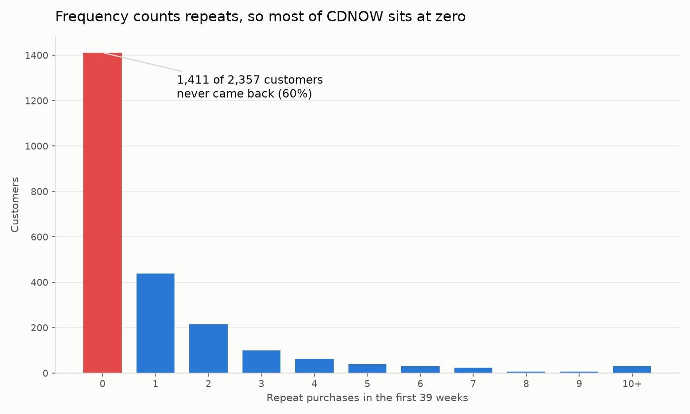

The shrug
=========

*I spent a week building a customer lifetime value model. I presented it
to the CMO, and he shrugged.*

He wasn't being rude. He had understood something faster than I did. The
thing I'd spent a week on was not going to change anything he did on
Monday.

He wanted two things, and he had been clear about both from the start.

   Who is worth retaining? How much to spend on doing it?

I had answered neither. I had answered a third question (every data
scientist has done exactly this once or twice), and nobody had asked it.
How much these people spent last year.

The formula, and the five others
--------------------------------

What I'd built was the standard thing. If you have ever calculated
customer lifetime value, you have probably built it too.

::

   CLV = average ticket × purchase frequency × margin

I called that the standard thing. It isn't even that. I searched "how to
calculate customer lifetime value formula" on 25 July 2026, and the
first three results gave five different formulas between them.

`Oracle's
NetSuite <https://www.netsuite.com/portal/resource/articles/ecommerce/customer-lifetime-value-clv.shtml>`__
multiplies average transaction size by number of transactions by
retention period.
`HubSpot <https://blog.hubspot.com/service/how-to-calculate-customer-lifetime-value>`__
multiplies customer value by average customer lifespan.

`Qualtrics <https://www.qualtrics.com/experience-management/customer/how-to-calculate-customer-lifetime-value/>`__
prints three on one page. The last of them is

::

   GML × retention rate / (1 + discount rate − retention rate)

Neither of the first two has margin anywhere in it. Mine did. A question
with a settled answer gets one formula, and this is a family of guesses
that can't agree on whether to divide by anything.

They have one thing in common. Each of them handles leaving (the moment
a customer stops buying from you) as an average over everybody, a
lifespan or a retention rate. Not one of them asks whether a particular
customer is still around.

The two questions it can't answer
---------------------------------

Who is worth retaining?
~~~~~~~~~~~~~~~~~~~~~~~

Ranking people by what they spent last year has one specific failure.
Your best customer might have stopped six months ago, and nothing in
that number knows it.

Nobody sends an email to say they are done. They just don't come back,
and you find out by waiting.

|Scatter of total spend against probability of being active, CDNOW
repeat buyers. Nineteen of the top spenders sit under thirty percent.|

*CDNOW, the 2,357 customers the 2005 paper used. Nineteen of the top
spending decile are under 30% likely to still be active. Rank by last
year's spend and every one of them is near the top of your retention
list.*

How much to spend on it?
~~~~~~~~~~~~~~~~~~~~~~~~

The second question fares worse. How much to spend needs a horizon and a
discount rate, and the formula has neither. $500 collected over ten
years and $500 collected over one year come out the same, and they are
not the same decision.

The first purchase proves nothing
---------------------------------

Purchase frequency, the middle term in my version, is also doing
something I didn't intend. Count a customer's purchases and you get
five. The models that take this seriously count four.

The difference is the first purchase, and they drop it for a reason that
survives being said out loud.

   A first purchase proves the person showed up. It proves nothing about
   whether they come back.

|Histogram of repeat purchases on CDNOW. The bar at zero holds 1,411 of
2,357 customers.|

*1,411 of the 2,357 never made a second purchase. Sixty percent of the
base carries no evidence at all, and the naive formula gives every one
of them a lifetime value anyway.*

Solved in the 1980s, missing in Python
--------------------------------------

Here is what I didn't know that week. This problem has been solved. Not
approximately, and not recently.

There is a line of work going back to the 1980s that treats "is this
customer still alive" as the thing to estimate, rather than the thing to
assume. It has a name nobody outside it uses: buy till you die.

I had expected to find a better heuristic. What I found was a
likelihood, and the difference turned out to matter more than the
accuracy did.

Here is the whole thing. While a customer is active they buy at random,
at their own rate. Rates vary across people. After any purchase they can
stop for good, at their own probability. Those vary too.

A gamma for the spread of buying rates, ``r`` and ``alpha``. A beta for
the spread of stopping, ``a`` and ``b``. Four parameters, and the whole
population falls out. The stopping is never observed. The model infers
it from a gap and nothing else.

You tune a heuristic until the output looks reasonable. You fit a
likelihood, and then you check it against numbers somebody else
published, on data they also used, decades before you got there.

The papers were free. The Python to run them was not there.

The library everyone had used was archived by its author in June 2024,
with its last release dating to 2020.

It was downloaded 248,263 times in the thirty days to 25 July 2026.
Downloads, not people. PyPI counts CI runs, mirrors and bots, and I
can't tell you how many of those were somebody typing ``pip install``.
What the number does tell you is that nothing has replaced it. Six years
without a release, two years archived, and the pipelines are still
pulling it down.

Its successor stopped at a beta in November 2022 and declares
``requires_python = ">=3.8,<3.10"``, which means it will not install on
anything current.

Both of their READMEs now point readers at a third project, which is
Bayesian, and excellent, and asks for a different kind of afternoon than
the one I had.

R still has a maintained one. ``CLVTools`` is on CRAN, updated November
2025, with Pareto/NBD, BG/NBD, Gamma/Gompertz/NBD and covariates in it.
The hole isn't in the field. It's in Python.

What I built
------------

So I built ``clvkit``, the thing I had wanted that week.

1. Four dependencies.
2. Three verbs: ``fit``, ``predict``, and ``probability_alive``, which
   is the CMO's first question with a function signature.
3. One rule I set early and have not been allowed to break since. The
   numbers in the README are not typed into a table, they are produced
   by a test that runs on every change.

Fader, Hardie and Lee fit four parameters to 2,357 customers and printed
them in *Marketing Science* in 2005: ``r = 0.243``, ``alpha = 4.414``,
``a = 0.793``, ``b = 2.426``. They show them in a screenshot of an Excel
worksheet.

My code, on the same data, gets 0.242595, 4.413602, 0.792922 and
2.425907. If that ever stops being true, the build fails and I find out
before anyone else does.

I built it with an AI assistant. You were going to wonder, so here it is
before you have to ask.

It didn't decide anything. ``opinions.md`` is seven places where the
literature left a choice open and I had to make one, each with the
options and what the choice costs written next to it. The parameter
check above is the other half of the answer, and it runs whether I want
it to or not. Every model in it cites its paper by DOI in
``docs/references.md``, and none of those papers is open access, so a
citation is as close as I can honestly get you to the source.

How it actually ended
---------------------

None of which would have saved that meeting.

He went and looked at Google Analytics instead, and made the decision he
had already wanted to make.

My analysis was not wrong. It lost to a chart that was already open, in
a tool he already trusted, which happened to agree with him. Rigour was
never what it was competing on.

--------------

::

   uv add clvkit     # or pip install clvkit

Run ``probability_alive`` on your own transactions. If it disagrees with
your spend ranking, you've just found the customers you were about to
spend money on for no reason.

.. |Scatter of total spend against probability of being active, CDNOW repeat buyers. Nineteen of the top spenders sit under thirty percent.| image:: figures/01-alive-vs-spend.png

